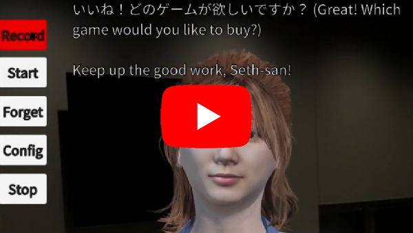
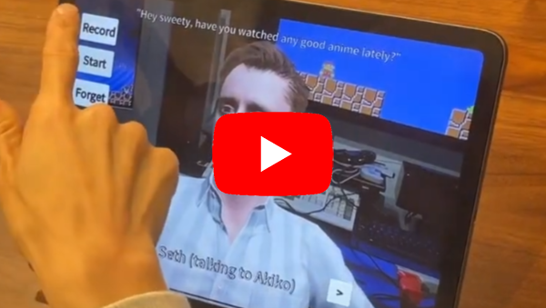

# GPTAvatar: 3D AI Virtual Chatbot made in Unity - Webversion
## Readme of this version
This is a WebGL version of SethRobinson's wonderful software GPTAvatar:
https://github.com/SethRobinson/GPTAvatar
I modified this version to allow use in Webbrowsers.
In order to get it to run you need to build/install a bit differently than in the original version:
- Buy, download, and install SALSA for lipsync, https://assetstore.unity.com/packages/tools/animation/salsa-lipsync-suite-148442
- Buy, download, and install Amplitude, https://assetstore.unity.com/packages/tools/audio/amplitude-for-webgl-111277
- Install the free Amplitude SALSA addon, https://crazyminnowstudio.com/posts/salsa-lipsync-in-webgl-with-amplitude/ 
-> you will have to click the big "download files" button at the bottom of the webpage and enter your invoice/order number, then download and import "AmplitudeSALSA (for SALSA LipSync v2) v2.0.0 (beta)"
- Buy, download, and install Microphone Pro for WebGL, https://assetstore.unity.com/packages/tools/input-management/microphone-pro-webgl-mobiles-desktop-79989
- Put the config.txt in another folder than in Seth Robinson's version:
   -> put it in the folder Assets\Resources\
- Now click on "Build settings" and choose under "Platform" "WebGL"
- Make the following adjustments to settings
- Asset Import Overrides -> Max 1024
- Player Settings -> Quality -> Rende Pipeline Asset -> URP Performant
- Player Settings -> Player -> Publishing Settings -> Compression format -> Brotli
- Player Settings -> Player -> WebGL Template -> Better minimal (if you cannot find this template here, download and install it https://seansleblanc.itch.io/better-minimal-webgl-template) 

  Now click on "Build settings" -> click on build
- The resulting folder should look like this:
  
- It can be used on your own webpage or on itch.io if you do not want to host it yourself
- If you want to host it on itch.io zip click on the folder and zip the full folder, upload that zip file! :)

## Check out the webversion
- If you want to test the webversion, go on: https://okapilab.itch.io/gptavatartest2, the password is: webtest!
- Click on "Run tool" and wait, it can take between 10 and 30 seconds
- Make sure to give microphone permissions
- The webversion should then work in your webbrowser! :)

## Using GPTAvatar for research and collaboration opportunities
If you use GPTAvatar for psychological/educational research, please either cite our article 
http://www.dx.doi.org/10.3389/feduc.2024.1416307 or Seth Robinson's github repository.
If you need more code modification or want to collaborate for scientific purposes, please reach out to Maximilian C. Fink (maximilian.fink@yahoo.com).
I'm always happy to help and conduct research together :)

# Other versions
There is a multi-player version of GPTAvatar, allowing multiple users to join a 
meeting and talk together via voice chat and with one avatar.
https://github.com/walterlars/Bachelorthesis-GPTAvatar/tree/main

# Orginal Readme of GPTAVatar by Seth Robinson
License:  BSD style attribution, see [LICENSE.md](LICENSE.md)

This is a technology test that uses APIs from OpenAI, ElevenLabs, and Google to allow a 3D AI character to converse with using a microphone.

It includes three "scenarios":

 * Japanese teacher - Atsuko sensei can teach any level Japanese.  She can create quizes or roleplay situations, like working at a store or whatever.
 * Seth - It's me!  You can talk to me.  Do not trust anything I say.  Unfortunately I can't share the custom voice I trained using ElevenLabs, so it's using a default one.
 * Big Burger - Order your food from the rudest fast food employee in the universe

New to AI with Unity?  Check the Assets/RT/AI directory, you'll see some simple ways to make API calls, that's what this app is using.  The 3D visuals are just for fun.

BTW, it is possible to build this on iOS, although I recently broke that when I added the config.txt editing stuff, but it can be done.

Note:  The "copy" button puts the dialog into the system clipboard, useful to get at the kanji if you're doing Japanese practice.

## Running it

 * Download [GPTAvatar (Windows, 300 MB)](https://www.rtsoft.com/files/GPTAvatar_Windows.zip) and unzip it somewhere
 * Rename config_template.txt to config.txt
 * Edit config.txt with a text editor, at a minimum you need to add your OpenAI API key.  Other API keys are required for "speaking", if you leave them blank the character won't actually talk.
 
 That's it.  If you have any problems, check the directory for files like tts_last_error_returned.json or similar, you can edit them with a text editor to see what's going on.

 To change the personality or add more characters, edit the config.txt, you'll see how.

 WARNING: These APIs cost real money to use, so watch out.  The ElevenLabs voices are probably the most pricey thing of all (but damn they sound real!), so consider switching to using Google's TTS instead to save money, just edit the config.txt for that character. The "teacher" is already set to use Google as Elevenlabs can't do Japanese.

## Building from this github source

* Requires Unity 2022.2+
* Open the scene "Main" and click play to run, it will give errors

To fix the errors, you'll need to buy [SALSA LipSync Suite](https://assetstore.unity.com/packages/tools/animation/salsa-lipsync-suite-148442) from the Unity asset store

* After installing the main plugin, also install the oneclickbase 2_5_0_2 package and oneclickcc 2_6_2 package, these are available from https://crazyminnowstudio.com/docs/salsa-lip-sync/addons/one-clicks/
 * In the file Assets/_Script/AIManager.cs make sure that #define CRAZY_MINNOW_PRESENT is uncommented
 * In the Unity editor, select the root 3d node that has the Animator object (Visuals/char_visual_seth/Seth) for example and then from the menu bar choose GameObject->Crazy Minnow Studio->Salsa LipSync->Oneclicks->Reallusion->CC4.  The Salsa objects on that entity should be enabled now and work in the game.  (The Salsa objects should turn blue) You'll have to do it to the teacher model too.
* If you want the model's eyes to look at the camera, you have to set the eye target to the camera. (only works right with the teacher)

Alternatively, you can ditch the lip syncing tech by editing Assets/_Script/AIManager.cs and commenting out #define CRAZY_MINNOW_PRESENT 

Note that when running from the Unity editor, it does more debug stuff, it writes out every .json it sends/receives for debugging purposes.
---

Credits and links

- Written by Seth A. Robinson (seth@rtsoft.com) twitter: @rtsoft - [Codedojo](https://www.codedojo.com), Seth's blog

Note:  The license only applies to my source code, for sound/graphics, uh, it might be complicated so don't count on being able to use any of that in a real product.

Engine: Unity

Listening: Whisper (via OpenAI's API)

Thinking: ChatGTP (via OpenAI's API)

Talking: ElevenLabs' Voicelab (trained on my voice)

3D Model: Reallusion's Headshot (model faces created using my picture and AI)

Lipsync: SALSA Lipsync Suite
